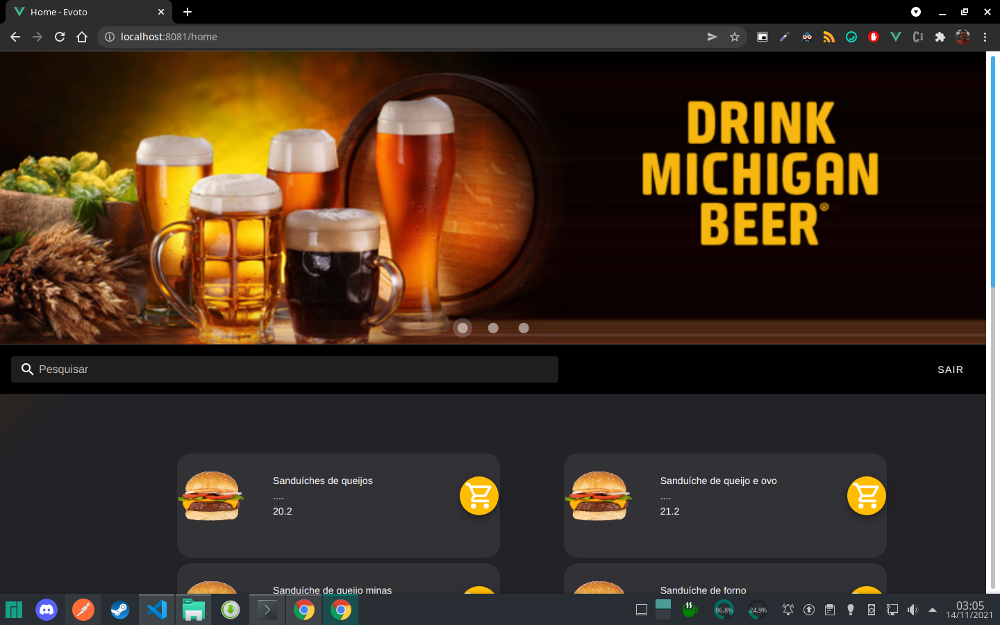
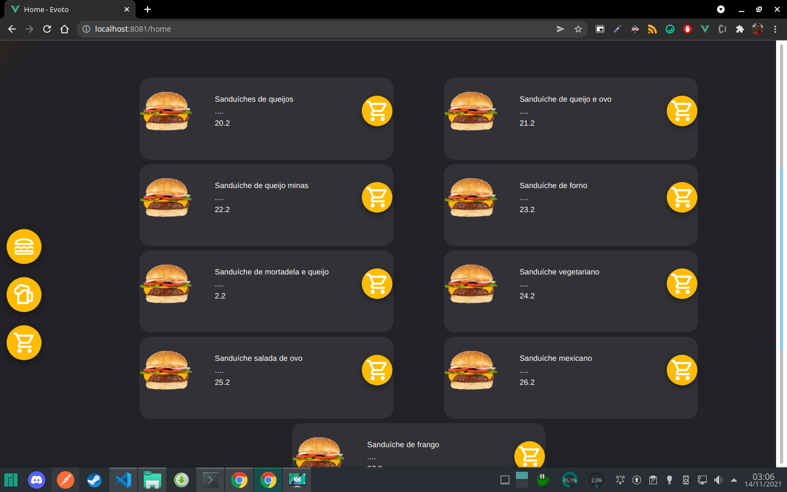
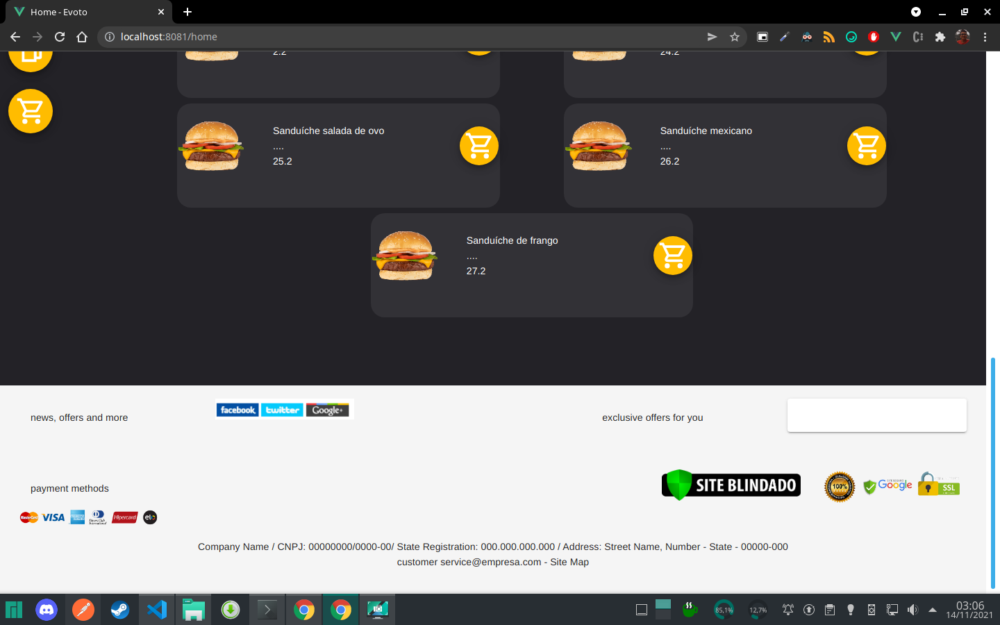
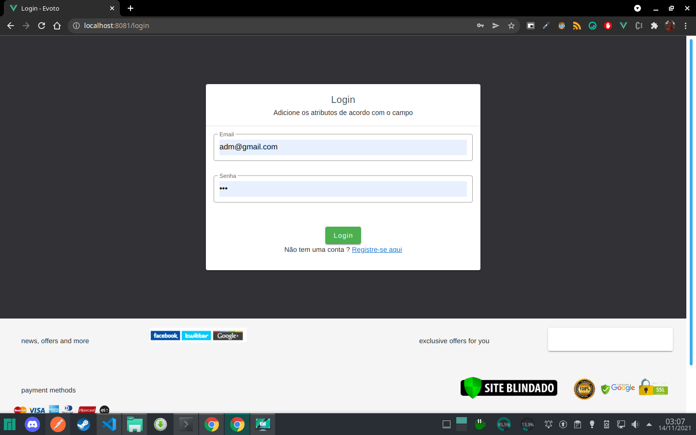
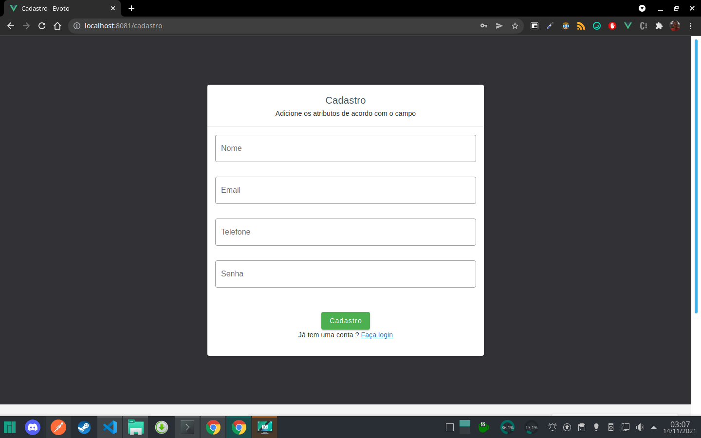
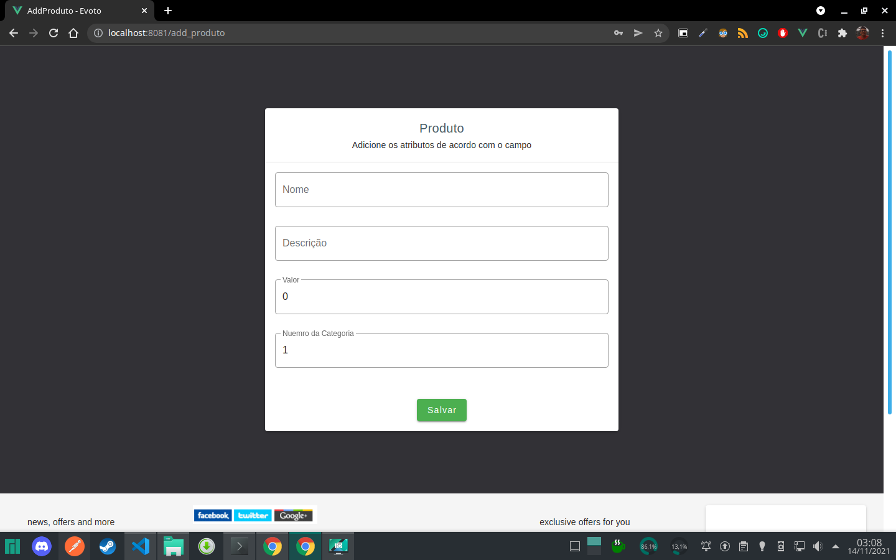

# hamburgueria

> Teste para vaga de Desenvolvedor de Software Junior 

` Esse projeto teve ênfase no backend `

### Dependência 
- Java 11
- PostgreSQL
- Node >=14
- Vuejs ~= 2
- Yarn

### Instalação das dependência do projeto 

/serve
``` bash 
./mvnw spring-boot:install
```
/web 
``` bash 
yarn install
```

### Rodando o projeto 

/serve 
``` bash 
./mvnw spring-boot:run
```
/web 
``` bash
yarn serve --port 8081
```
### Usuários predefinido
#### Adm:

Email:`adm@gmail.com`

Senha:`123`

#### Comum:

Email:`ronaldo@gmail.com`

Senha:`123`

### Informaçãoes sobre as etapas do projeto
[Tarefas](https://github.com/pedroermarinho/hamburgueria/projects/1?fullscreen=true)

### Endpoint da api

A [documentação](https://github.com/pedroermarinho/hamburgueria/blob/main/docs/hamburgueria.md) dos endpoint podem ser encontrados no diretorio docs. 

Os endpoint também podem ser encontrados em um arquivo exportação do postma dentro do diretorio [docs](https://github.com/pedroermarinho/hamburgueria/tree/main/docs) ou no link abaixo.
[hamburgueria.postman_collection.json](https://raw.githubusercontent.com/pedroermarinho/hamburgueria/main/docs/hamburgueria.postman_collection.json?token=AHB7FOTO36GUB4U2L2YWGGTBSIDAY)

### Screenshots








